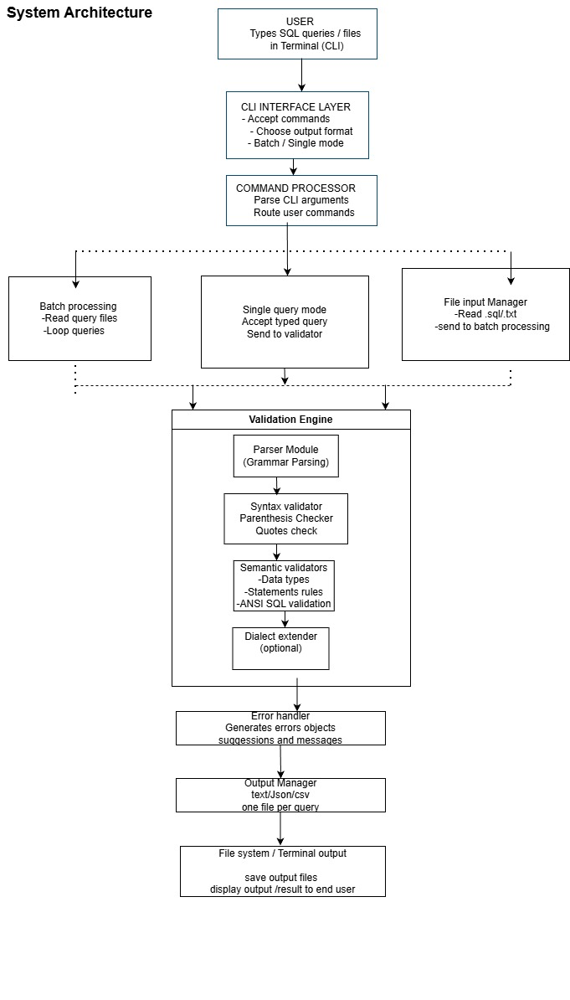
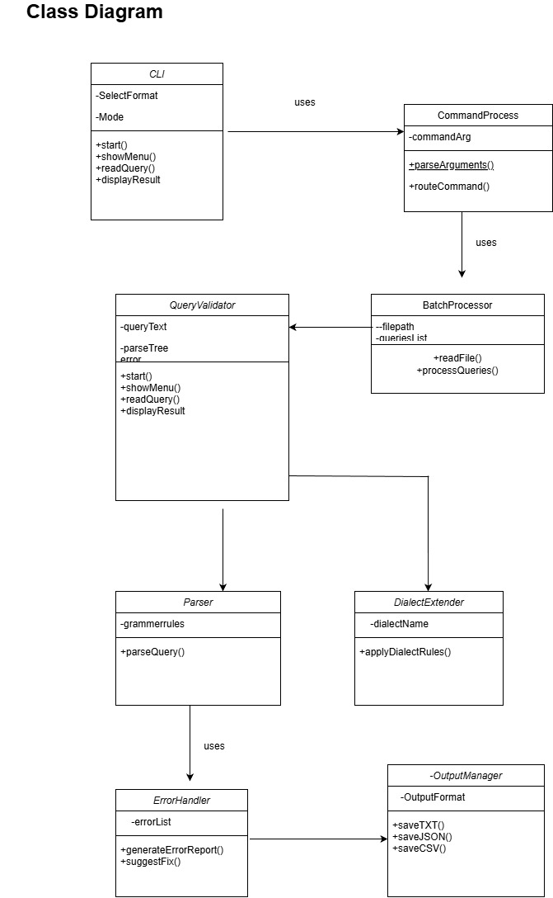
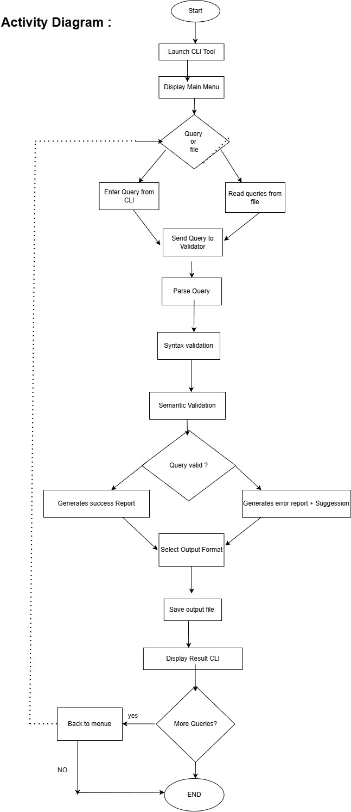
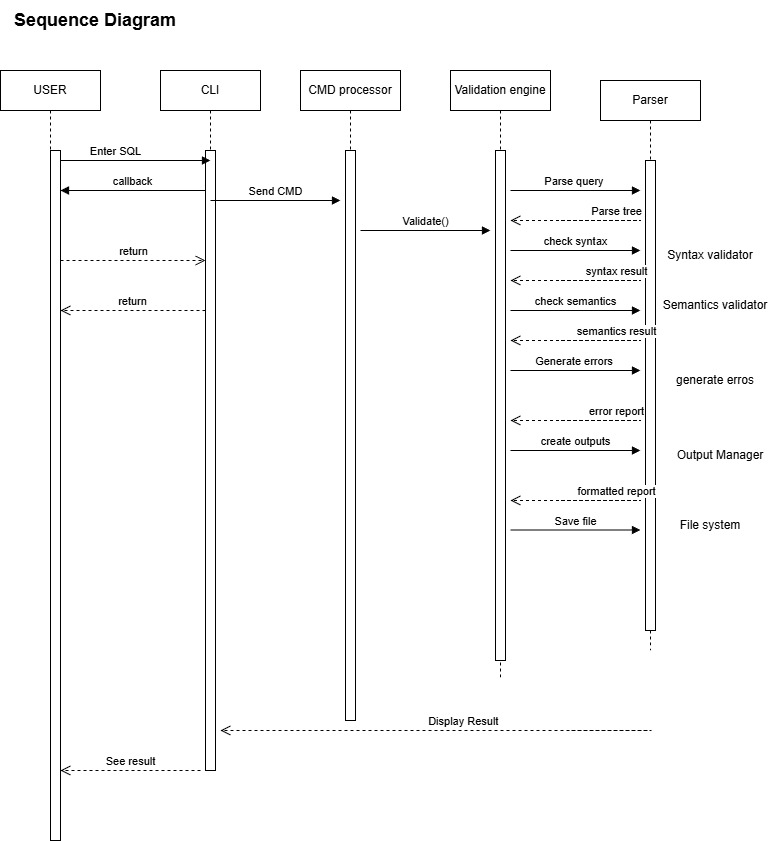

ANSI SQL VALIDATOR — Design Documentation

Group name - Gryffindore

Group no -1

members- 1)Shreyas Chothe
         2)Adwait Chavan
         3)Mansi kawale
1. Project Name
ANSI SQL Validator (CLI Based)
________________________________________
2. Project Overview
The ANSI SQL Validator is a Command Line Interface (CLI) tool that validates SQL queries against ANSI SQL standards.
The system analyzes query structure, detects syntax and semantic errors, and generates validation reports in multiple formats.
The architecture separates the CLI interface from the validation engine to ensure modularity and future scalability such as SQL dialect extensions.
________________________________________
3. Target Audience
This tool is intended for:
•	Students learning SQL and DBMS
•	Developers writing SQL queries
•	Beginners needing instant query feedback
•	Educators demonstrating SQL syntax
•	CLI tool users and testers
________________________________________
4. Purpose & Value
The goal is to provide a lightweight offline SQL validation tool that helps detect errors before running queries on a database.
Value Provided
•	Helps beginners learn correct SQL syntax
•	Reduces debugging time
•	Provides structured error reports
•	Supports batch query validation
•	Works without internet connection
•	Extendable for SQL dialects (MySQL/PostgreSQL)
________________________________________
5. Software Version
Component	Version
Programming Language	 Python 3.x
Operating Systems	Windows
Development Tools	VS Code 
Testing Framework	PyTest
________________________________________
6. Test Coverage
Testing is performed using PyTest.
Tested Modules
•	Parser module
•	Syntax validation
•	Semantic validation
•	CLI commands
•	Batch processing
•	Output file generation
Test Cases Include
•	Valid queries
•	Invalid queries
•	Nested & subqueries
•	Large input file testing
•	Output format verification
________________________________________
7. CLI Features
Supported Operations
•	Validate single SQL query
•	Validate queries from file (Batch mode)
•	Choose output format (TXT / JSON / CSV)
•	Save validation reports
•	Display results in terminal
•	Safe exit from system
Modes
Single Query Mode
•	User types query directly.
Batch Mode
•	Reads queries from .sql or .txt
•	Processes sequentially
•	Generates one output file per query
________________________________________
8. Technical Architecture (Overview)
Main system modules:
1.	CLI Interface
2.	Command Processor
3.	Batch Processor
4.	Validation Engine
o	Parser
o	Syntax Validator
o	Semantic Validator
o	Dialect Extender
5.	Error Handler
6.	Output Manager
7.	File System Layer
________________________________________

Diagrams:-
9. System Architecture Diagram

The following diagram shows the high-level system architecture and data flow.

10.Class Diagram

This diagram shows major classes and their relationships.

11.Activity Diagram 

This diagram shows the workflow from user input to output generation

12.Sequence Diagram

This diagram illustrates interaction between system components during query validation.

13. Detailed Module Design
14. 
13.1 CLI Layer
Responsible for user interaction.
Functions
•	Accept SQL input
•	Display results
•	Provide command menu
________________________________________
13.2 Command Processor
Acts as controller.
Responsibilities
•	Parse CLI arguments
•	Decide execution mode
•	Route commands
________________________________________
13.3 Batch Processor
Handles multiple queries efficiently.
Responsibilities
•	Read query files
•	Process sequentially
•	Avoid loading full file in memory
________________________________________
13.4 Validation Engine (Core)
Parser Module
•	Converts query into parse tree
•	Applies grammar rules
Syntax Validator
Detects:
•	Parentheses errors
•	Quote mismatch
•	Missing clauses
•	Incorrect structure
Semantic Validator
Validates:
•	Data types
•	Statement rules
•	ANSI SQL compliance
Dialect Extension (Future)
Support for MySQL/PostgreSQL.
________________________________________
13.5 Error Handler
•	Generates error objects
•	Suggests fixes
•	Sends results to Output Manager
________________________________________
13.6 Output Manager
Generates reports:
•	TXT → Human readable
•	JSON → Structured
•	CSV → Spreadsheet compatible
Rule: One output file per query.

14 Future Scope

The ANSI SQL Validator can be further enhanced with several improvements to increase its usability and functionality:

Graphical User Interface (GUI):
Develop a GUI version to make it more user-friendly, allowing users to validate queries without using the command line.

Support for Multiple SQL Dialects:
Extend support beyond ANSI SQL to handle dialects like MySQL, PostgreSQL, and Oracle SQL for wider applicability.

Auto-Correction Suggestions:
Implement features to suggest corrections or highlight the exact location of syntax errors for faster debugging.

Integration with IDEs:
Provide plugins or extensions for popular IDEs like VS Code or IntelliJ IDEA to validate SQL queries in real-time.

Advanced Query Analysis:
Add capabilities to check query optimization, detect logical errors, and provide performance tips.

Online or Cloud Version:
Make the validator accessible via a web interface or as a cloud-based service for collaborative environments.

Conclusion

The ANSI SQL Validator project successfully provides a command-line interface (CLI) tool to validate SQL queries for syntax correctness according to ANSI SQL standards. The project ensures that users can quickly identify and correct errors in their SQL statements, improving code quality and reducing debugging time. By supporting multiple SQL operations, including SELECT, INSERT, UPDATE, and DELETE, the validator enhances database development efficiency. The modular design and clear architecture make the system easy to maintain, extend, and integrate into larger software projects.

Overall, this project demonstrates a practical application of Java programming, SQL parsing, and error-handling mechanisms, offering a reliable tool for both learners and professionals working with databases.

