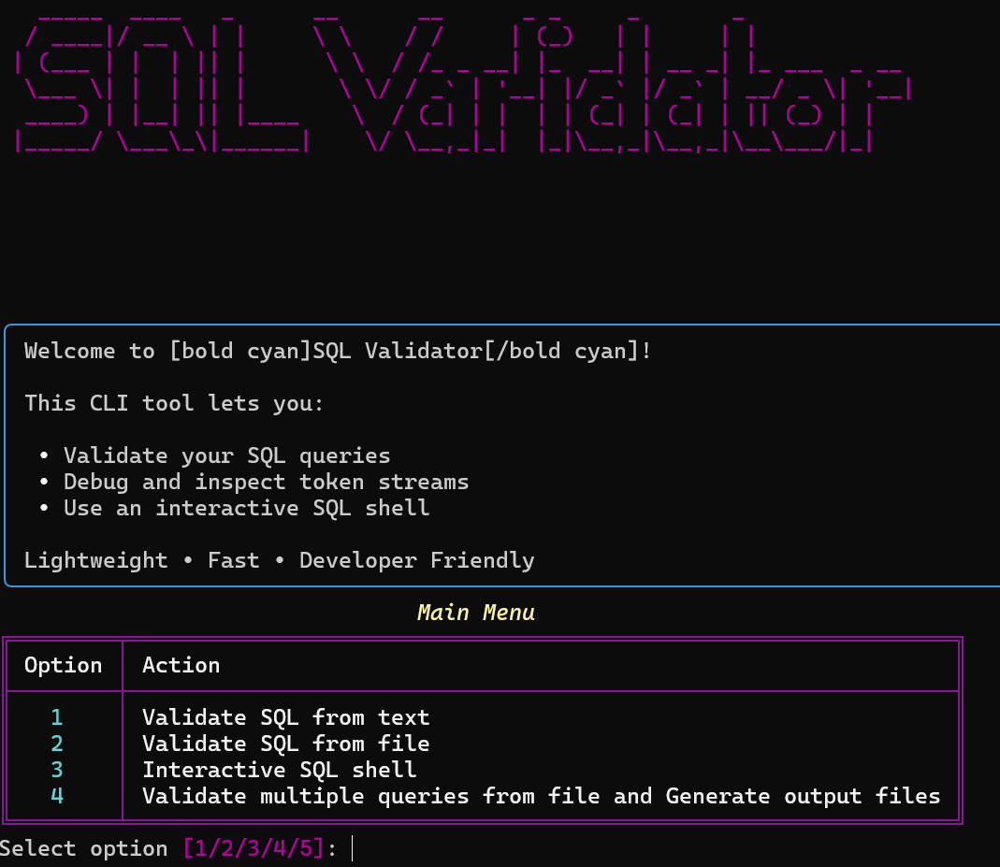
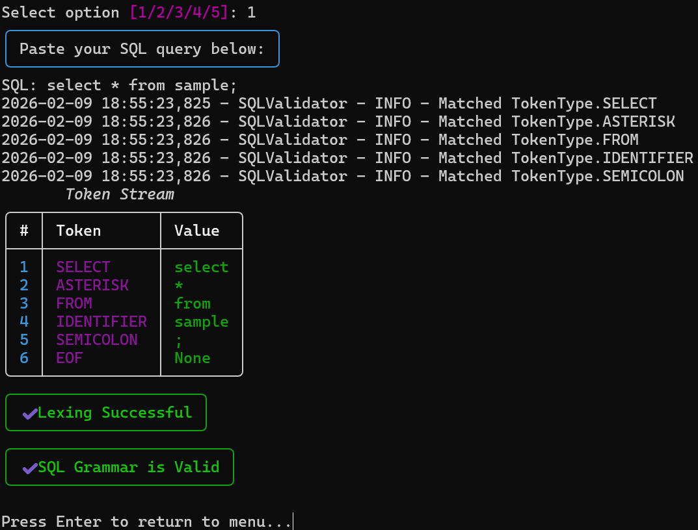
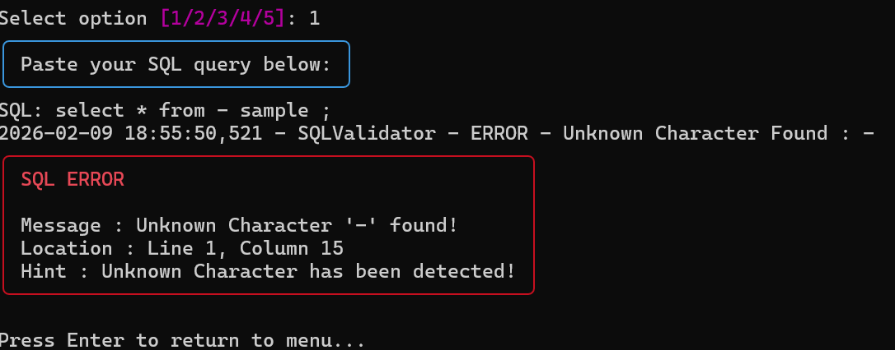
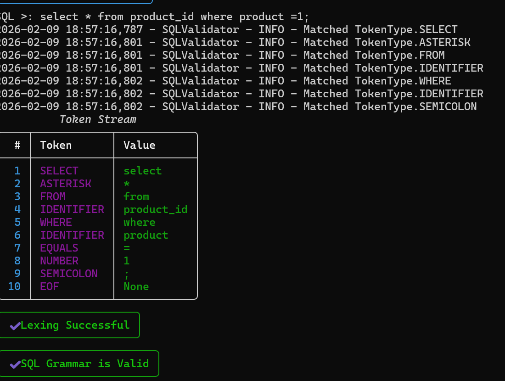
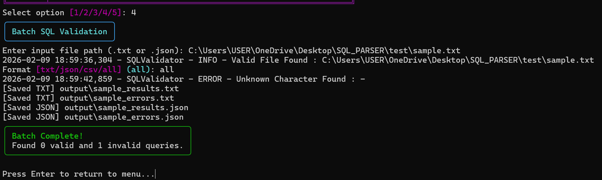

Project Title:- ANSI SQL Validator
Project Description: The ANSI SQL Validator is a standalone Python application that validates SQL queries by performing lexical analysis, syntactic parsing, and rule-based validation. The system analyzes SQL statements without requiring a database connection and generates structured error reports in JSON format when validation fails.
This project simulates core compiler design principles, including token generation, syntax tree validation, and error handling mechanisms, making it a lightweight SQL syntax checking engine.

MAIN MENUE:

Validate SQL from text
Validates a single SQL query entered directly in the CLI and displays tokens and grammar validation result.

if error then display error message

Validate SQL from file
Reads a SQL query from a .txt or .json file and checks its syntax and token stream.

Interactive SQL shell
Launches a mini SQL shell where users can continuously type and validate multiple SQL queries until exit.

Batch validation + generate output files
Validates multiple SQL queries from a file and automatically generates result and error reports in TXT, JSON, and CSV formats.

Output files :

Exit
Closes the application safely.

Key Features:
1. SQL Tokenization (Lexical Analysis)
•	Breaks SQL queries into tokens (keywords, identifiers, operators, symbols, literals).
•	Handles symbols like *, ;, (, ) etc.
________________________________________
 2. Syntax Parsing
•	Validates SQL structure (e.g., SELECT → FROM → WHERE order).
•	Ensures correct clause placement.
•	Detects missing keywords or invalid sequence.
________________________________________
 3. Rule-Based Validation
•	Checks SQL statements against ANSI SQL rules.
•	Verifies required components (e.g., table name after FROM).
•	Supports validation of multiple SQL queries.
________________________________________
 4. Multi-Query File Processing
•	Can read and validate multiple SQL statements from a file.
•	Processes each query independently.
________________________________________
 5. Structured Error Reporting
•	Returns detailed error messages.
•	Includes:
o	Error message
o	Line number
o	Column number
o	Additional details (if available)
________________________________________
 6. JSON Error Output
•	Outputs validation errors in structured JSON format.
•	Easy to integrate with other systems or tools.
________________________________________
 7. Database-Independent Validation
•	No database connection required.
•	Fully static SQL syntax validation.
________________________________________
 8. Modular Architecture
•	Clean separation of components:
o	lexer.py
o	parser.py
o	validator.py
o	error.py
•	Easy to extend and maintain.
________________________________________
 9. Object-Oriented Design
•	Uses classes and structured error objects.
•	Encapsulated logic for clean code design.
________________________________________
 10. Logging Support (if you added logging)
•	Logs validation process for debugging.
Technologies Used
 1. Python 3.x
•	Core programming language used to build the application.
•	Used for implementing Lexer, Parser, and Validator logic.
________________________________________
 2. Object-Oriented Programming (OOP)
•	Classes for:
o	Lexer
o	Parser
o	Validator
o	Error handling
•	Encapsulation and modular design principles applied.
________________________________________
 3. JSON
•	Used for structured error output.
•	Helps generate machine-readable validation results.
________________________________________
 4. Logging Module (if used)
•	Python’s built-in logging module.
•	Used for debugging and tracking execution flow.
________________________________________
 5. File Handling
•	Python file I/O for:
o	Reading .sql files
o	Writing .json output files
________________________________________
 6. ANSI SQL (Standard)
•	SQL syntax rules followed during validation.
•	Static syntax checking without database execution.

Installation Instructions
1. Prerequisites
Make sure you have:
•	Python 3.8 or higher installed
•	Git (For cloning repository)

2 . Clone the Repository
Clone the Repository
git clone https://github.com/your-username/sql-validator.git
cd sql-validator

Install Dependencies
pip install rich

Work Flow
| Input → Lexer → Parser → Validator → Error / Success Output |

Future Improvements
1. Support for More SQL Dialects
•	Add support for:
o	MySQL
o	PostgreSQL
o	Oracle SQL
•	Handle dialect-specific syntax differences.
________________________________________
 2. Advanced Query Support
•	Support complex queries like:
o	JOIN operations
o	Subqueries
o	GROUP BY / HAVING
o	Nested SELECT statements
o	Window functions
________________________________________
 3. Semantic Validation
Currently you check syntax only.
Future improvement:
•	Validate table existence (with schema file)
•	Validate column names
•	Detect duplicate columns
•	Type checking
________________________________________
 4. GUI Interface
•	Build a simple frontend using:
o	Tkinter (Python)
o	Web UI using Flask / FastAPI
•	Allow users to paste SQL queries and see real-time validation.
________________________________________
 5. Real-Time Validation (Like IDE)
•	Integrate with:
o	VS Code extension
o	Web-based editor
•	Show errors while typing.
________________________________________
 6. Performance Optimization
•	Improve parsing efficiency.
•	Handle large SQL files.
•	Optimize token processing.
________________________________________
 7. Unit Testing & Test Coverage
•	Add automated test cases.
•	Use unittest or pytest.
•	Improve reliability.
________________________________________
 8. Error Recovery Mechanism
•	Instead of stopping at first error:
o	Continue parsing
o	Report multiple errors in one run.
________________________________________
 9. Docker Support
•	Containerize the project.
•	Easy deployment.
________________________________________
 10. Convert to Full SQL Engine
•	Extend project to:
o	Query execution engine
o	In-memory database support
